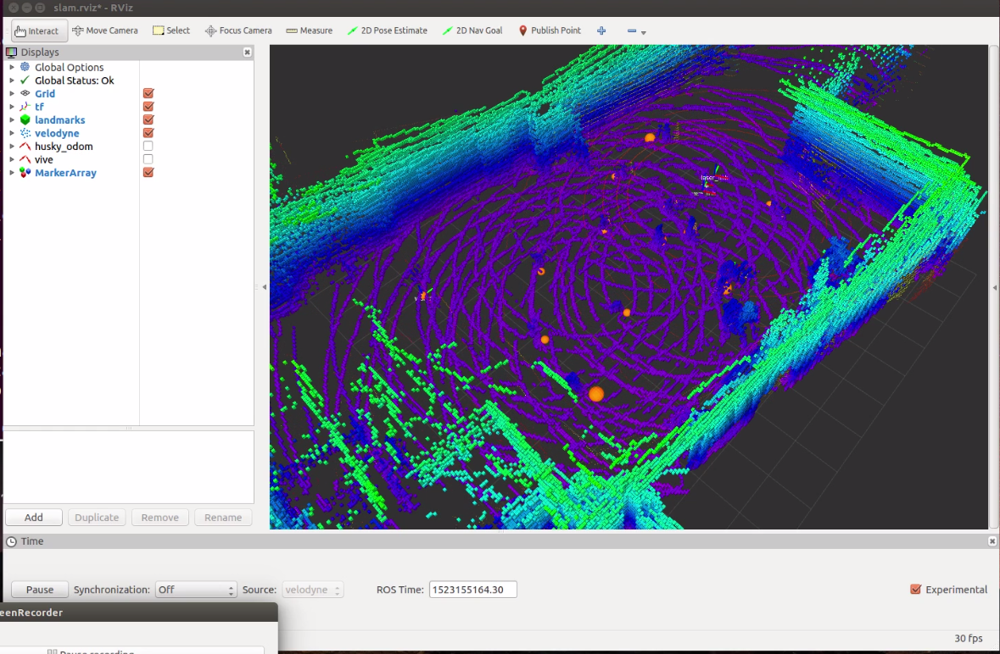
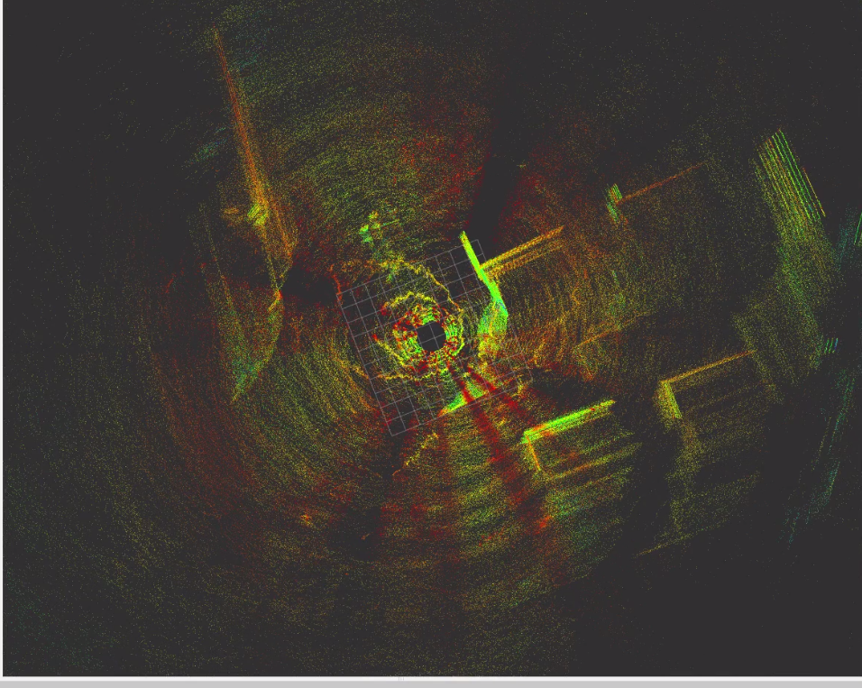

octomap_mapping
===============

ROS stack for mapping with OctoMap, contains the octomap_server package.

The `master` branch tracks the latest (stable) releases. Please send pull requests against the latest development branch, e.g. `indigo-devel`.

Imported from SVN, see https://code.google.com/p/alufr-ros-pkg/ for the previous versions.


# Octomap based Slam

***Disclaimer:*** The original work can be found at https://github.com/OctoMap/octomap_mapping and we take no credit for the author's work.
Authors: A. Hornung, K. M. Wurm, M. Bennewitz, C. Stachniss, and W. Burgard

Octomap is an efficient probabilistic 3D framework based on octrees. It explicitly represents not only the occupied spaces but also free and unknown areas. In general Octomap, is used to provide a volumetric representation of the space. For this project, a ROS package called Octompas_server was used.

## Results
***Husky Dataset***

<a href="https://drive.google.com/file/d/1rU3aXs5g2d_ciipC6XRWltZgh0Zybvik/view?usp=sharing">video link</a>



***Quad Dataset***

<a href="https://drive.google.com/file/d/1WFh_8XqtnBgP5Ufzq6dLM6HAzVguAhqJ/view?usp=sharing">video link</a>



## Requirements
*Note that this package should be installed in ROS indigo in Ubuntu 14.04*

## Steps
1. In the octomap_mapping launch file, the remapping for the point cloud has to be changed. In this case, we used a velodyne and therefore, the following command was used to change it.
<remap ="cloud_in" to="/velodyne_points" />

2.  The fixed frame in the launch file was set to
“World” for Husky dataset and “Velodyne” for
Quadcopter dataset.
3. In the same launch file, there is another section called
the sensor max, where the value was set to 20 metres.
One can set , a different value based on the
type of the sensor used.
4. Use rosbag play to play the respective bagfiles.
5.  Finally launch the package

## Husky Dataset Instructions
Download [husky.bag](https://drive.google.com/file/d/1QqVY7z-3ojrfrI3Q6LTY4Ui_0nkOpEqO/view?usp=sharing) into catkin_ws/bags/

```bash
rosbag play husky.bag
rolaunch octomapping_launch
```
### Visualization
Use Rviz and add the following topics for visualization
1. /velodyne_points
2. /occupied_cells_vis_array

## Quad Dataset Instructions
Download [nardos3.bag](https://drive.google.com/file/d/1jjilcRgPEUWECLCSd0r0EZuduAeX_RGM/view?usp=sharing) into catkin_ws/bags/

```bash
rosbag play nardo3.bag
roslaunch octomapping_launch
```


